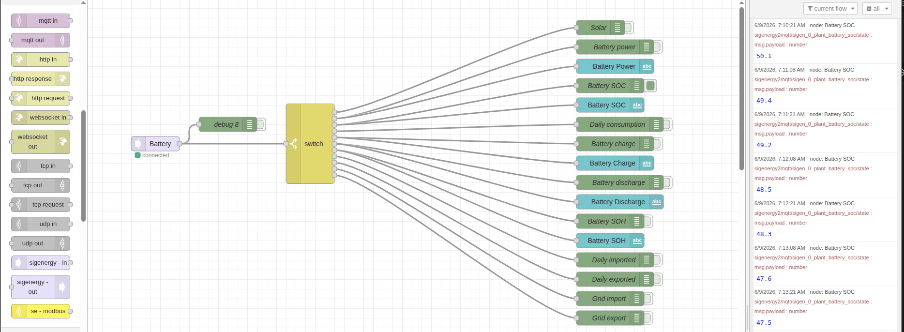

# node-red-contrib-sigenergy

Node-RED custom nodes to monitor and control **Sigenergy** inverters and Energy Storage Systems (ESS) via the local MQTT broker interface of `sigenergy2mqtt`.

This package leverages the shared core connection pool of Node-RED's built-in `mqtt-broker` configuration node, ensuring optimized connection usage and credential security.

---

## Prerequisites

1. A running **[sigenergy2mqtt](https://github.com/seud0nym/sigenergy2mqtt)** service bridging your Sigenergy inverter Modbus-TCP data to your local MQTT broker.
2. Modbus-TCP enabled on your Sigenergy inverter (configured using the installer app).
3. (Optional) **Remote EMS mode** enabled on your inverter if you intend to send control and configuration write commands (e.g. changing battery charge limits).

---

## Installation

### Option 1: Palette Manager (Recommended)
1. Open your Node-RED editor in the browser.
2. Click the top-right menu and select **Manage palette**.
3. Go to the **Install** tab.
4. Search for `node-red-contrib-sigenergy`.
5. Click **Install**.

---

### Option 2: Command Line
To install this package via the command line:

1. Open a terminal in your Node-RED user directory (typically `~/.node-red`).
2. Run the following command:
   ```bash
   npm install node-red-contrib-sigenergy
   ```
3. Restart Node-RED.

---

## Nodes Included

### 1. Sigenergy In
Listens for state updates and metrics from your Sigenergy inverter.

*   **Inverter ID Auto-Discovery:** Simply select your MQTT broker, type the base topic, and click the **Discover** button to scan for active inverter IDs (e.g., `sigen_0_inverter_1`).
*   **Flexible Output Modes:**
    *   **Split (Default):** Triggers a Node-RED message instantly whenever any individual sensor changes.
    *   **Grouped (Aggregated):** Maintains the latest state of all sensors for the inverter in memory, emitting a combined JSON object. This mode uses a **250ms debouncer** to aggregate multiple values arriving in rapid succession.
*   **Sensor Filtering:** Filter incoming sensor messages by capability category:
    *   🔋 **Battery**: SoC, Health, Charge/Discharge limits, BMS data.
    *   ☀️ **Solar**: Solar yield, PV power, MPPT data.
    *   🔌 **Grid**: Import/Export power, active phase power, smart meter data.
    *   🚗 **EV**: EV Charger status.
    *   ⚙️ **Other**: House loads, temperatures, operation modes.

### 2. Sigenergy Out
Sends settings and controls to the inverter via the `sigenergy2mqtt` MQTT command topic.

*   **Predefined Commands:**
    *   Set Battery Max Charging Power Limit (W)
    *   Set Battery Max Discharging Power Limit (W)
    *   Set Battery Charge Cut-off SoC (%)
    *   Set Battery Discharge Cut-off SoC (%)
    *   Set Remote EMS Control Mode
*   **Custom Commands:** Write to any writable register/sensor by choosing the "Custom" command option and entering the register suffix.
*   **Dynamic Overrides:** Overwrite the target device or command programmatically using incoming message properties:
    *   `msg.inverterId` overrides the configured Inverter ID.
    *   `msg.sensor` or `msg.command` overrides the target register/command name.
*   **Payload Support:** Send values dynamically from `msg.payload` or configure a static fixed value inside the node settings.

---

## Topic Mapping Details

- **State Topics:** `[baseTopic]/[inverterId]_[sensorName]/state` (e.g. `sigenergy2mqtt/sigen_0_inverter_1_battery_soc/state`)
- **Command/Set Topics:** `[baseTopic]/[inverterId]_[sensorName]/set` (e.g. `sigenergy2mqtt/sigen_0_inverter_1_ess_charge_cut_off_soc/set`)

---

## Example Flow

Here is a visual representation of how the nodes can be configured in Node-RED:



### Import Flow
You can copy the JSON code below and import it directly into your Node-RED editor (**Menu** -> **Import** -> **Clipboard**).

```json
[
    {
        "id": "df82e5750c0021f5",
        "type": "tab",
        "label": "Sigenergy",
        "disabled": false,
        "info": "",
        "env": []
    },
    {
        "id": "df384361d71664b5",
        "type": "sigenergy-in",
        "z": "df82e5750c0021f5",
        "name": "Battery",
        "broker": "3d9601b4.ffffce",
        "baseTopic": "sigenergy2mqtt",
        "inverterId": "all",
        "outputMode": "split",
        "filterSensors": true,
        "catBattery": true,
        "catSolar": true,
        "catGrid": false,
        "catEV": false,
        "catOther": false,
        "x": 410,
        "y": 300,
        "wires": [
            [
                "5e9fd77c9906422d",
                "53a55861520593b7"
            ]
        ]
    },
    {
        "id": "5e9fd77c9906422d",
        "type": "debug",
        "z": "df82e5750c0021f5",
        "name": "debug 8",
        "active": false,
        "tosidebar": true,
        "console": false,
        "tostatus": false,
        "complete": "false",
        "statusVal": "",
        "statusType": "auto",
        "x": 560,
        "y": 260,
        "wires": []
    },
    {
        "id": "53a55861520593b7",
        "type": "switch",
        "z": "df82e5750c0021f5",
        "name": "",
        "property": "topic",
        "propertyType": "msg",
        "rules": [
            {
                "t": "eq",
                "v": "sigenergy2mqtt/sigen_0_third_party_pv_power/state",
                "vt": "str"
            },
            {
                "t": "eq",
                "v": "sigenergy2mqtt/sigen_0_plant_battery_power/state",
                "vt": "str"
            },
            {
                "t": "eq",
                "v": "sigenergy2mqtt/sigen_0_plant_battery_soc/state",
                "vt": "str"
            },
            {
                "t": "eq",
                "v": "sigenergy2mqtt/sigen_0_daily_consumed_energy/state",
                "vt": "str"
            },
            {
                "t": "eq",
                "v": "sigenergy2mqtt/sigen_0_battery_charging_power/state",
                "vt": "str"
            },
            {
                "t": "eq",
                "v": "sigenergy2mqtt/sigen_0_battery_discharging_power/state",
                "vt": "str"
            },
            {
                "t": "eq",
                "v": "sigenergy2mqtt/sigen_0_plant_battery_soh/state",
                "vt": "str"
            },
            {
                "t": "eq",
                "v": "sigenergy2mqtt/sigen_0_inverter_1_daily_charge_energy/state",
                "vt": "str"
            },
            {
                "t": "eq",
                "v": "sigenergy2mqtt/sigen_0_inverter_1_daily_discharge_energy/state",
                "vt": "str"
            },
            {
                "t": "eq",
                "v": "sigenergy2mqtt/sigen_0_inverter_1_daily_discharge_energy/state",
                "vt": "str"
            },
            {
                "t": "eq",
                "v": "sigenergy2mqtt/sigen_0_grid_sensor_export_power/state",
                "vt": "str"
            }
        ],
        "checkall": "true",
        "repair": false,
        "outputs": 11,
        "x": 730,
        "y": 300,
        "wires": [
            [
                "3e86f555cdbfd382"
            ],
            [
                "e2743dbe91d767b3",
                "7271a4d98cc36057"
            ],
            [
                "2ae508d994132529",
                "cec24e0d29e7fc34"
            ],
            [
                "f8ef68c5641cb798"
            ],
            [
                "428353c73f9bbbf4",
                "39d0bb9a9956887e"
            ],
            [
                "9d4f6b97c60981e0",
                "cad7b4463e9753a6"
            ],
            [
                "c5606adf97d01315",
                "71846d0d2ad410c9"
            ],
            [
                "cd7db907048aba58"
            ],
            [
                "2ce91b5bed84ba07"
            ],
            [
                "6097380ff1cb7378"
            ],
            [
                "3034b819bae9ffdf"
            ]
        ]
    },
    {
        "id": "3e86f555cdbfd382",
        "type": "debug",
        "z": "df82e5750c0021f5",
        "name": "Solar",
        "active": false,
        "tosidebar": true,
        "console": false,
        "tostatus": false,
        "complete": "payload",
        "targetType": "msg",
        "statusVal": "",
        "statusType": "auto",
        "x": 1330,
        "y": 60,
        "wires": []
    },
    {
        "id": "e2743dbe91d767b3",
        "type": "debug",
        "z": "df82e5750c0021f5",
        "name": "Battery power",
        "active": false,
        "tosidebar": true,
        "console": false,
        "tostatus": false,
        "complete": "payload",
        "targetType": "msg",
        "statusVal": "",
        "statusType": "auto",
        "x": 1360,
        "y": 100,
        "wires": []
    },
    {
        "id": "2ae508d994132529",
        "type": "debug",
        "z": "df82e5750c0021f5",
        "name": "Battery SOC",
        "active": true,
        "tosidebar": true,
        "console": false,
        "tostatus": false,
        "complete": "payload",
        "targetType": "msg",
        "statusVal": "",
        "statusType": "auto",
        "x": 1350,
        "y": 180,
        "wires": []
    },
    {
        "id": "f8ef68c5641cb798",
        "type": "debug",
        "z": "df82e5750c0021f5",
        "name": "Daily consumption",
        "active": false,
        "tosidebar": true,
        "console": false,
        "tostatus": false,
        "complete": "payload",
        "targetType": "msg",
        "statusVal": "",
        "statusType": "auto",
        "x": 1370,
        "y": 260,
        "wires": []
    },
    {
        "id": "428353c73f9bbbf4",
        "type": "debug",
        "z": "df82e5750c0021f5",
        "name": "Battery charge",
        "active": false,
        "tosidebar": true,
        "console": false,
        "tostatus": false,
        "complete": "payload",
        "targetType": "msg",
        "statusVal": "",
        "statusType": "auto",
        "x": 1360,
        "y": 300,
        "wires": []
    },
    {
        "id": "9d4f6b97c60981e0",
        "type": "debug",
        "z": "df82e5750c0021f5",
        "name": "Battery discharge",
        "active": false,
        "tosidebar": true,
        "console": false,
        "tostatus": false,
        "complete": "payload",
        "targetType": "msg",
        "statusVal": "",
        "statusType": "auto",
        "x": 1370,
        "y": 380,
        "wires": []
    },
    {
        "id": "c5606adf97d01315",
        "type": "debug",
        "z": "df82e5750c0021f5",
        "name": "Battery SOH",
        "active": false,
        "tosidebar": true,
        "console": false,
        "tostatus": false,
        "complete": "payload",
        "targetType": "msg",
        "statusVal": "",
        "statusType": "auto",
        "x": 1350,
        "y": 460,
        "wires": []
    },
    {
        "id": "cd7db907048aba58",
        "type": "debug",
        "z": "df82e5750c0021f5",
        "name": "Daily imported",
        "active": false,
        "tosidebar": true,
        "console": false,
        "tostatus": false,
        "complete": "payload",
        "targetType": "msg",
        "statusVal": "",
        "statusType": "auto",
        "x": 1360,
        "y": 540,
        "wires": []
    },
    {
        "id": "2ce91b5bed84ba07",
        "type": "debug",
        "z": "df82e5750c0021f5",
        "name": "Daily exported",
        "active": false,
        "tosidebar": true,
        "console": false,
        "tostatus": false,
        "complete": "payload",
        "targetType": "msg",
        "statusVal": "",
        "statusType": "auto",
        "x": 1360,
        "y": 580,
        "wires": []
    },
    {
        "id": "6097380ff1cb7378",
        "type": "debug",
        "z": "df82e5750c0021f5",
        "name": "Grid import",
        "active": false,
        "tosidebar": true,
        "console": false,
        "tostatus": false,
        "complete": "payload",
        "targetType": "msg",
        "statusVal": "",
        "statusType": "auto",
        "x": 1350,
        "y": 620,
        "wires": []
    },
    {
        "id": "3034b819bae9ffdf",
        "type": "debug",
        "z": "df82e5750c0021f5",
        "name": "Grid export",
        "active": false,
        "tosidebar": true,
        "console": false,
        "tostatus": false,
        "complete": "payload",
        "targetType": "msg",
        "statusVal": "",
        "statusType": "auto",
        "x": 1350,
        "y": 660,
        "wires": []
    },
    {
        "id": "cec24e0d29e7fc34",
        "type": "ui_text",
        "z": "df82e5750c0021f5",
        "group": "868503feecef954b",
        "order": 7,
        "width": 0,
        "height": 0,
        "name": "",
        "label": "Battery SOC",
        "format": "{{msg.payload}} %",
        "layout": "row-spread",
        "className": "",
        "x": 1350,
        "y": 220,
        "wires": []
    },
    {
        "id": "7271a4d98cc36057",
        "type": "ui_text",
        "z": "df82e5750c0021f5",
        "group": "868503feecef954b",
        "order": 4,
        "width": 0,
        "height": 0,
        "name": "",
        "label": "Battery Power",
        "format": "{{msg.payload}} kWh",
        "layout": "row-spread",
        "className": "",
        "x": 1360,
        "y": 140,
        "wires": []
    },
    {
        "id": "39d0bb9a9956887e",
        "type": "ui_text",
        "z": "df82e5750c0021f5",
        "group": "868503feecef954b",
        "order": 5,
        "width": 0,
        "height": 0,
        "name": "",
        "label": "Battery Charge",
        "format": "{{msg.payload}} kW",
        "layout": "row-spread",
        "className": "",
        "x": 1360,
        "y": 340,
        "wires": []
    },
    {
        "id": "cad7b4463e9753a6",
        "type": "ui_text",
        "z": "df82e5750c0021f5",
        "group": "868503feecef954b",
        "order": 6,
        "width": 0,
        "height": 0,
        "name": "",
        "label": "Battery Discharge",
        "format": "{{msg.payload}} kW",
        "layout": "row-spread",
        "className": "",
        "x": 1370,
        "y": 420,
        "wires": []
    },
    {
        "id": "71846d0d2ad410c9",
        "type": "ui_text",
        "z": "df82e5750c0021f5",
        "group": "868503feecef954b",
        "order": 8,
        "width": 0,
        "height": 0,
        "name": "",
        "label": "Battery SOH",
        "format": "{{msg.payload}} %",
        "layout": "row-spread",
        "className": "",
        "x": 1350,
        "y": 500,
        "wires": []
    },
    {
        "id": "3d9601b4.ffffce",
        "type": "mqtt-broker",
        "name": "MyHomeMqtt",
        "broker": "192.168.68.129",
        "port": "1883",
        "clientid": "SmilesHasItNodeRed01",
        "autoConnect": true,
        "usetls": false,
        "compatmode": false,
        "protocolVersion": "4",
        "keepalive": "60",
        "cleansession": true,
        "birthTopic": "",
        "birthQos": "0",
        "birthPayload": "",
        "birthMsg": {},
        "closeTopic": "",
        "closeQos": "0",
        "closePayload": "",
        "closeMsg": {},
        "willTopic": "",
        "willQos": "0",
        "willPayload": "",
        "willMsg": {},
        "userProps": "",
        "sessionExpiry": ""
    },
    {
        "id": "868503feecef954b",
        "type": "ui_group",
        "name": "Elektriciteit actueel",
        "tab": "a468ab2147fcd233",
        "order": 1,
        "disp": true,
        "width": "6",
        "collapse": false,
        "className": ""
    },
    {
        "id": "a468ab2147fcd233",
        "type": "ui_tab",
        "name": "Energie",
        "icon": "dashboard",
        "order": 2,
        "disabled": false,
        "hidden": false
    }
]
```

---

## License

MIT License. See [LICENSE](LICENSE) for more details.
